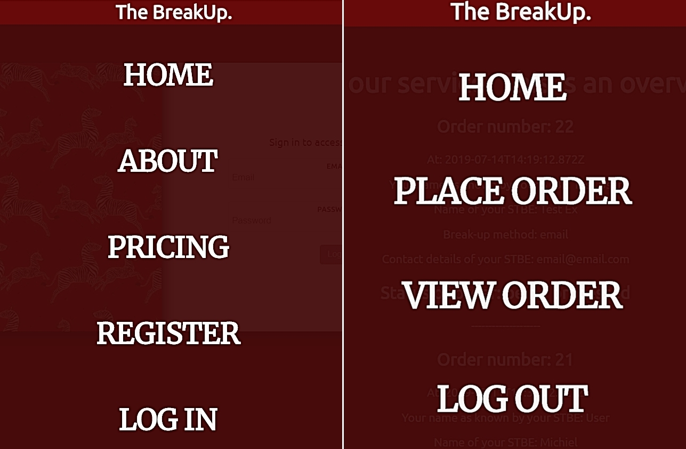
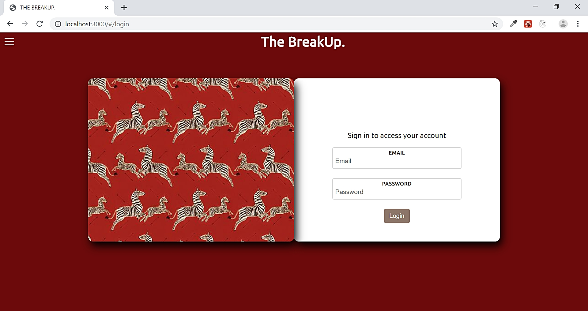
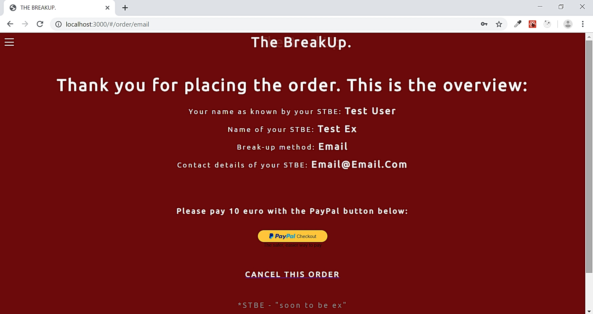
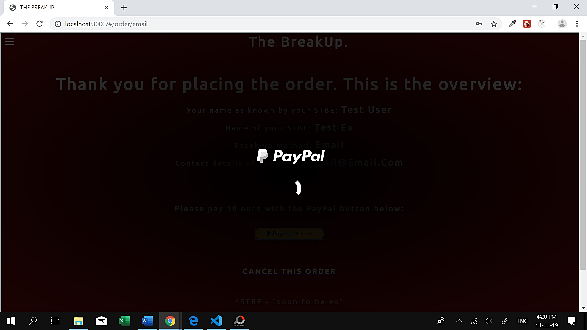
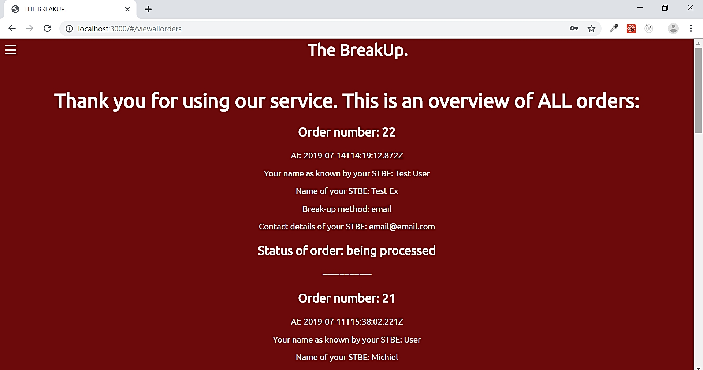
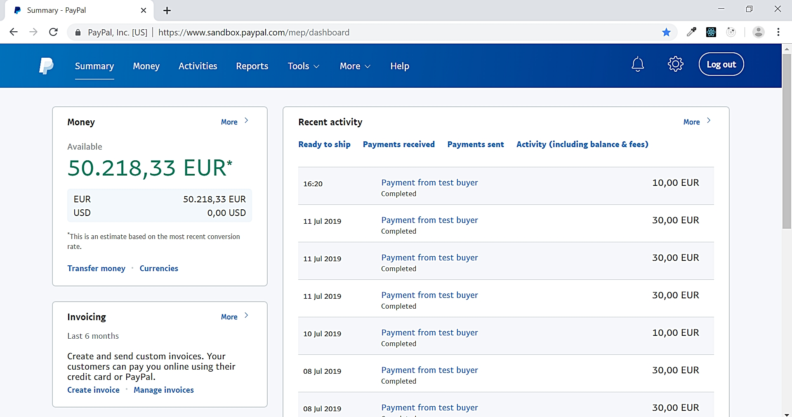

# breakup-service-fullstack-app
This is a fullstack website created with Node and React, providing service with Paypal checkout option. 
* Postgres SQL
* Node JS
* React 
* Javascript
* Dependencies: axios, bcrypt, concurrently, cookie-parser, dotenv, express, express-flash, express-session, express-validator, morgan, pg, pg-hstore, react-paypal-express-checkout, react-router-dom, sequelize.

After registering and logging in, users can place an order and pay for it via Paypal checkout. Users can see all orders that has been place in their account. 

Different navigation bar before and after logging in:

Log in page:

Overview of order before payment:

Checking out with Paypal:

Overview of all orders history:

Paypal account of testing shop owner with all transactions:

